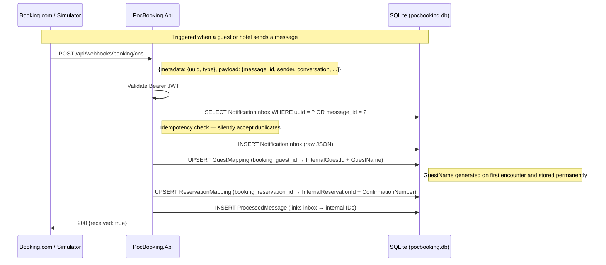
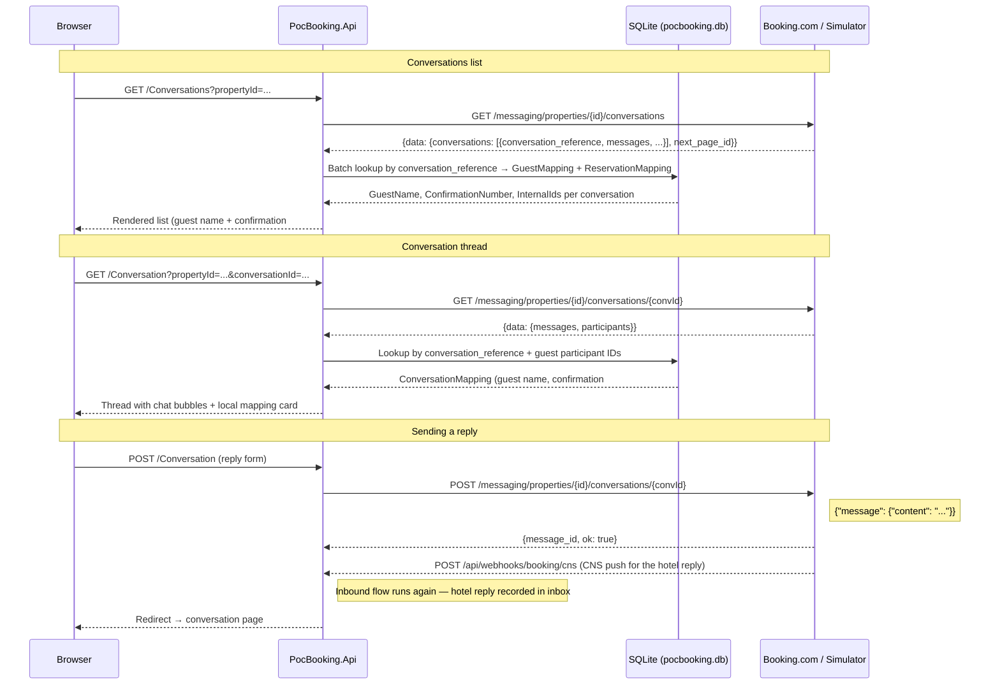
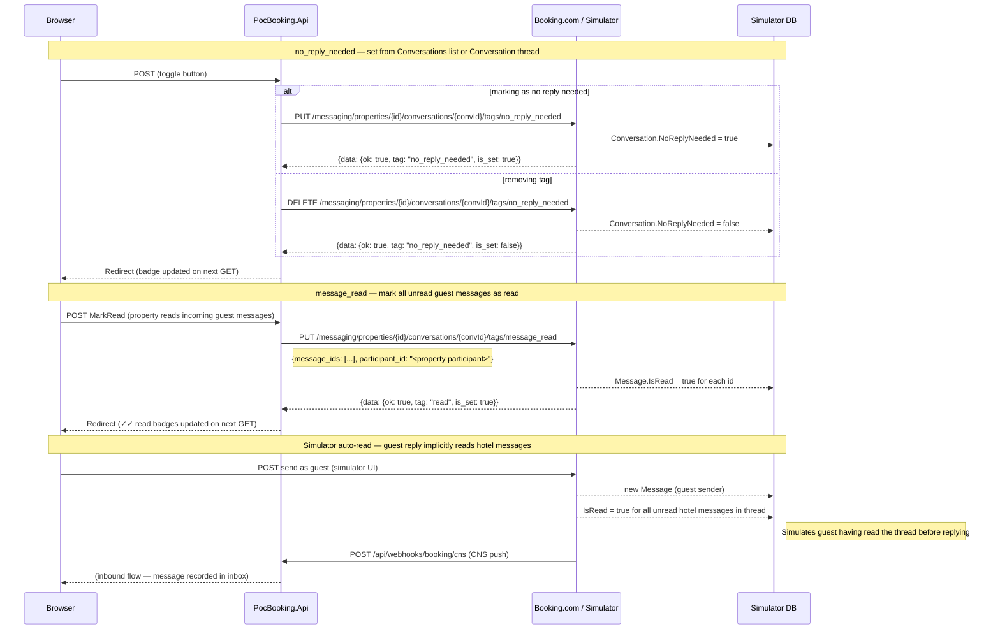

# POC: Communication with Booking.com

Proof-of-concept for integrating with **Booking.com Messaging API** via the **Connectivity Notification Service (CNS)** — using the webhook-driven flow, not the deprecated `GET /messages/latest` polling.

## Purpose

- Validate the end-to-end flow: CNS webhooks → webhook endpoint → idempotent processing.
- Prove identity mapping (guest, reservation, conversation) and local enrichment.
- Demonstrate a realistic UI showing conversations and their local context.
- Inform a production implementation in the Communication platform.

## Documentation

| Document | Description |
|----------|-------------|
| [booking-cns-messaging-overview.md](booking-cns-messaging-overview.md) | Technical and business limitations, delivery model, retention, identity mapping, and authentication for CNS-based messaging. |

## Solution layout

| Project | Purpose | Port (HTTP) |
|---------|---------|-------------|
| **PocBooking.Api** | POC: webhook receiver, idempotency, enrichment, identity mapping, conversation UI. | 5154 |
| **PocBooking.BookingSimulator** | Simulates Booking.com: Messaging API + CNS webhooks; Razor Pages UI for driving conversations. | 5160 |
| **PocBooking.AppHost** | .NET Aspire host: runs both projects together. | — |

## Message flow

### Inbound — CNS push (new message notification)

A message sent from the Booking.com side triggers a webhook push to the POC API. This is the only way the POC learns about new messages.



### Outbound — reading and replying to conversations

The POC UI fetches conversations from the Booking Messaging API and overlays local identity data from SQLite.



### Tag manipulation — no reply needed & message read

The POC UI can set and unset conversation/message tags directly via the Booking Messaging API. The simulator reflects tag state set by the POC and additionally simulates the guest-side read behaviour.



## Tech Stack

- **.NET 10** — both projects are ASP.NET Core minimal Web APIs with Razor Pages.
- **SQLite + EF Core 10** — each project has its own database, migrated automatically on startup.
- **.NET Aspire** — local orchestration via `Aspire.AppHost.Sdk` (no workload install required).

---

## Running the projects

### With Aspire (recommended)

```bash
dotnet run --project src/PocBooking.AppHost
```

- **POC API**: http://localhost:5154
- **Simulator**: http://localhost:5160
- **Dashboard**: URL printed to console on startup (e.g. http://localhost:15300)

If you see *Address already in use* for 5154 or 5160, stop any previous instance of the AppHost, Api, or Simulator (`lsof -i :5154` / `lsof -i :5160`).

### POC API standalone

```bash
dotnet run --project src/PocBooking.Api
```

### Simulator standalone

```bash
dotnet run --project src/PocBooking.BookingSimulator
```

---

## PocBooking.Api

Receives CNS webhooks from Booking.com (or the simulator), enriches them with local identity data, and provides a read-only conversation UI backed by the Booking Messaging API.

### Endpoints

| Method | Path | Description |
|--------|------|-------------|
| `POST` | `/api/webhooks/booking/cns` | CNS webhook receiver. JWT validation when `Booking:Cns:JwtSigningKey` is configured. Idempotent by `metadata.uuid` and `payload.message_id`. |
| `GET` | `/api/health` | SQLite connectivity check. |
| `GET` | `/` | Redirects to `/Index`. |

### Razor Pages UI

| Page | Path | Description |
|------|------|-------------|
| Index | `/Index` | Landing page with links to Conversations and Inbox. |
| Conversations | `/Conversations?propertyId=...` | Lists all conversations for a property. Primary identifiers are **guest name** and **confirmation number** from local mappings; falls back to Booking.com conversation ID. Each row shows a **🔕 toggle button** to set or remove the `no_reply_needed` tag inline without opening the conversation. Paginated. |
| Conversation | `/Conversation?propertyId=...&conversationId=...` | Full conversation thread with chat bubbles. Shows a **local mapping card** (guest name, confirmation number, internal IDs) when CNS enrichment has run. Header shows the **`no_reply_needed` badge** and a toggle button, a **`read-only` badge** when `access=read_only`, and a **Mark all read** button when there are unread guest messages. Each message bubble carries a **✓✓ read** or **unread** badge. Reply form sends as property. |
| Inbox | `/Inbox` | Raw CNS webhook inbox: every received `MESSAGING_API_NEW_MESSAGE` notification with its guest name, confirmation number, and Booking.com IDs. |

### Enrichment and identity mapping

When a `MESSAGING_API_NEW_MESSAGE` CNS webhook arrives, `EnrichCnsMessageService` extracts the Booking.com guest and reservation identifiers from the payload and creates or retrieves local mappings:

- **`GuestMapping`** — maps `booking_guest_id` → `InternalGuestId` (UUID) + a generated `GuestName`.
- **`ReservationMapping`** — maps `booking_reservation_id` → `InternalReservationId` (UUID) + a generated `ConfirmationNumber`.
- **`ProcessedMessage`** — links a `NotificationInbox` record to its resolved internal IDs.

Guest names and confirmation numbers are randomly generated on first encounter and stored permanently, so the same guest/reservation always resolves to the same local identity.

### Mapping service

`IConversationMappingService` (in `Mapping/`) encapsulates all DB lookups:

- `GetMappingAsync(ref, guestParticipantIds, ct)` — resolves local identity for a single conversation thread.
- `GetMappingsByRefAsync(refs, ct)` — batch-resolves for the conversations list page.

### SQLite schema (`pocbooking.db`)

| Table | Contents |
|-------|----------|
| `NotificationInbox` | Every received CNS notification (raw JSON, uuid, message_id, type). |
| `GuestMapping` | Booking guest ID → internal UUID + generated guest name. |
| `ReservationMapping` | Booking reservation ID → internal UUID + generated confirmation number. |
| `ProcessedMessage` | Links inbox records to resolved InternalReservationId + InternalGuestId. |

Database is created and migrated automatically on startup.

### POC configuration

| Key | Description |
|-----|-------------|
| `ConnectionStrings:DefaultConnection` | SQLite path (default: `Data Source=pocbooking.db`). |
| `Booking:ApiBaseUrl` | Outbound Messaging API base URL. Use simulator (`http://localhost:5160`) or real Booking.com URL. |
| `Booking:ApiKey` | Optional Bearer token for the Messaging API. |
| `Booking:Cns:JwtSigningKey` | Symmetric key for validating incoming CNS webhook JWTs. |
| `Booking:Cns:JwtIssuer` | Expected `iss` claim in CNS webhook JWTs. |
| `Booking:Cns:JwtAudience` | Expected `aud` claim in CNS webhook JWTs. |
| `Booking:Cns:RequireSignatureValidation` | Set to `true` when a signing key is configured. |

---

## PocBooking.BookingSimulator

Simulates both sides of Booking.com: the Messaging API (REST) and the CNS push delivery. Fully interchangeable with the real Booking.com API by config change in PocBooking.Api.

### Booking-style Messaging API

All endpoints are under `/messaging`. Authentication is `Authorization: Bearer <ApiKey>` (optional; only enforced when `BookingSimulator:ApiKey` is set).

Response envelope on all endpoints: `{ meta: { ruid }, data: { ... }, errors: [], warnings: [] }`.

| Method | Path | Description |
|--------|------|-------------|
| `GET` | `/messaging/properties/{propertyId}/conversations` | List conversations (optional `?page_id`). Returns 50 per page with all messages and participants per conversation. |
| `GET` | `/messaging/properties/{propertyId}/conversations/{conversationId}` | Full conversation thread: all messages (with `tags.read` and `attachment_ids`) + participants. Wrapped as `data.conversation`. |
| `POST` | `/messaging/properties/{propertyId}/conversations/{conversationId}` | Send a message as property. Body: `{ "message": { "content": "...", "attachment_ids": [] } }`. Fires a CNS webhook to the POC. Response: `data.{ message_id, ok, guest_has_account }`. |
| `GET` | `/messaging/messages/search` | Create an async search job. Query params: `after`, `before` (ISO 8601), `property_id`, `order_by`. |
| `GET` | `/messaging/messages/search/result/{jobId}` | Fetch messages for a search job (optional `?page_id`). Returns 410 if expired (48 h TTL). |
| `PUT` | `/messaging/properties/{propertyId}/conversations/{conversationId}/tags/no_reply_needed` | Set the `no_reply_needed` tag. No request body. Response: `data.{ ok, tag, is_set: true }`. |
| `DELETE` | `/messaging/properties/{propertyId}/conversations/{conversationId}/tags/no_reply_needed` | Remove the `no_reply_needed` tag. Response: `data.{ ok, tag, is_set: false }`. |
| `PUT` | `/messaging/properties/{propertyId}/conversations/{conversationId}/tags/message_read` | Mark one or more messages as read. Body: `{ "message_ids": [...], "participant_id": "..." }`. Response: `data.{ ok, tag: "read", is_set: true }`. |
| `DELETE` | `/messaging/properties/{propertyId}/conversations/{conversationId}/tags/message_read` | Remove the `message_read` tag from messages. Same body as PUT. Response: `data.{ ok, tag: "read", is_set: true }` (indicates operation success). |

### Simulate endpoints

| Method | Path | Description |
|--------|------|-------------|
| `GET` | `/api/simulate/sample` | Returns a sample `MESSAGING_API_NEW_MESSAGE` payload (JSON). |
| `POST` | `/api/simulate/deliver` | Fires a one-off CNS notification to the POC webhook. Optional body: `{ "notificationUuid": "...", "messageId": "...", "content": "..." }`. |

### Token-based authentication endpoint

Simulates the Booking.com connectivity-authentication service at the same relative path as the real API:

| Method | Path | Description |
|--------|------|-------------|
| `POST` | `/token-based-authentication/exchange` | Exchange `client_id` + `client_secret` for an RS256-signed JWT. Matches the shape of the real `https://connectivity-authentication.booking.com/token-based-authentication/exchange` endpoint. |
| `GET` | `/token-based-authentication/.well-known/jwks.json` | Returns the public key in JWKS format so callers (e.g. PocBooking.Api) can validate the issued tokens. |

Request body:
```json
{
  "client_id": "08BA24DE-243C-11F1-8C94-61FAFA3EEF80",
  "client_secret": "SECRET_HERE"
}
```

Response:
```json
{
  "jwt": "<RS256 signed JWT>",
  "ruid": "<random UUID>"
}
```

The issued JWT has the same structure as the real Booking.com connectivity JWT:
- **Header**: `{ "kid": "1", "typ": "JWT", "alg": "RS256" }`
- **Payload**: `sub`, `aud`, `test`, `machine_account_id`, `iss` (`urn://connectivity-modern-auth/v1`), `provider_id`, `exp` (1 h), `iat`, `client_id`, `jti`

The simulator generates an ephemeral RSA-2048 key pair at startup. Credentials are validated when `BookingSimulator:Auth:ClientId` and `BookingSimulator:Auth:ClientSecret` are both set; otherwise any non-empty credentials are accepted.

Example:
```bash
curl -X POST http://localhost:5160/api/simulate/deliver
curl -X POST http://localhost:5160/api/simulate/deliver \
  -H "Content-Type: application/json" \
  -d '{"content":"Custom test message"}'
```

### Razor Pages UI

Open http://localhost:5160 in a browser.

| Page | Description |
|------|-------------|
| Index | Lists all properties; for the selected property shows conversations with linked guest name, last-message preview, and a **🔕 No reply needed** badge when set by the POC. |
| New Conversation | Creates a conversation with a configurable `ConversationReference` (reservation number). Optionally create a new named guest participant, pick an existing one, or proceed with no guest linked. |
| Conversation | Full thread with chat bubbles. Send messages as **guest** (uses the conversation's linked guest participant) or **hotel**. Each send fires a CNS webhook to the POC. Hotel messages show a **✓✓ read** or **unread** badge reflecting whether the guest has read them. Sending as guest automatically marks all unread hotel messages as read (simulates the guest reading the thread before replying). The **🔕 No reply needed** badge is displayed when set by the POC — the simulator shows this as read-only and does not allow toggling it. |

### SQLite schema (`booking-simulator.db`)

| Table | Contents |
|-------|----------|
| `Properties` | Simulated properties (seeded on first run with one property). |
| `Participants` | Guest and hotel participants scoped to a property. |
| `Conversations` | Conversations with `ConversationReference`, optional `GuestParticipantId` FK, and `NoReplyNeeded` flag. |
| `Messages` | All messages with sender, timestamp, and `IsRead` flag. |
| `MessageSearchJobs` | Async search jobs (48 h TTL). |

Database is seeded on first run with one property, one hotel participant, and one guest participant with a welcome conversation.

### Simulator configuration

| Key | Description |
|-----|-------------|
| `ConnectionStrings:DefaultConnection` | SQLite path (default: `Data Source=booking-simulator.db`). |
| `BookingSimulator:PocWebhookBaseUrl` | POC base URL for CNS delivery (e.g. `http://localhost:5154`). |
| `BookingSimulator:SendWebhookOnNewMessage` | Fire CNS webhook after each new message (`true` by default). |
| `BookingSimulator:PocBearerToken` | Opaque Bearer token sent to POC webhook when JWT config is not set. |
| `BookingSimulator:JwtSigningKey` | Symmetric key for signing CNS webhook JWTs (match with `Booking:Cns:JwtSigningKey` in POC). |
| `BookingSimulator:JwtIssuer` | JWT `iss` claim (match with `Booking:Cns:JwtIssuer` in POC). |
| `BookingSimulator:JwtAudience` | JWT `aud` claim (match with `Booking:Cns:JwtAudience` in POC). |
| `BookingSimulator:ApiKey` | Optional. If set, `/messaging/*` requires `Authorization: Bearer <ApiKey>`. |
| `BookingSimulator:Auth:ClientId` | Expected `client_id` for `/token-based-authentication/exchange`. Leave empty to accept any credentials. |
| `BookingSimulator:Auth:ClientSecret` | Expected `client_secret`. Leave empty to accept any credentials. |
| `BookingSimulator:Auth:MachineAccountId` | Value of the `machine_account_id` claim in issued JWTs (default: `15810`). |
| `BookingSimulator:Auth:ProviderId` | Value of the `provider_id` claim in issued JWTs (default: `1432`). |

---

## Switching from simulator to real Booking.com

The POC API is designed so that only configuration changes are needed to switch from the simulator to the real Booking.com API.

| Concern | Simulator | Real Booking.com |
|---------|-----------|------------------|
| **Messaging API base URL** | `Booking:ApiBaseUrl` = `http://localhost:5160` | `Booking:ApiBaseUrl` = Booking's API base URL |
| **Messaging API auth** | `Booking:ApiKey` matching `BookingSimulator:ApiKey` (optional) | `Booking:ApiKey` = real Booking.com API key |
| **CNS webhook JWT** | `Booking:Cns:JwtSigningKey/Issuer/Audience` matching simulator config | `Booking:Cns:JwtIssuer/Audience` = Booking's values; extend validator for JWKS if needed |
| **Webhook accessibility** | Both services on localhost | POC's `/api/webhooks/booking/cns` must be publicly reachable |

No code changes are required. All Messaging API endpoints consumed by the POC — conversations list, conversation thread, send message, and all four tag endpoints — are faithfully simulated with the exact same JSON wire format as the real Booking.com API.

---

## References

- [Booking.com Connectivity Notification Service](https://developers.booking.com/connectivity/docs/notification-service/notification-service-overview)
- [Booking.com Messaging API](https://developers.booking.com/connectivity/docs/messaging-api/understanding-the-messaging-api)
- [CNS Authentication](https://developers.booking.com/connectivity/docs/notification-service/authentication)
