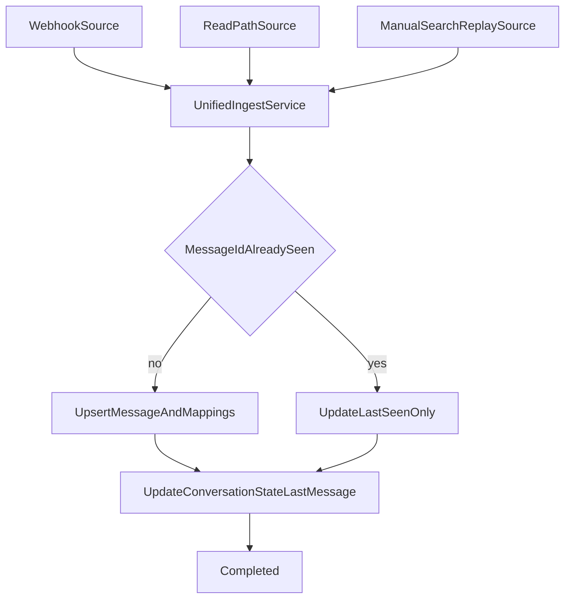

# Missed Notification Recovery Plan

## Selected approach (hybrid)

Use both mechanisms together:

- **ConversationState table** is the source of truth for whether a message/conversation state has already been seen.
- **Search API replay** remains the manual safety net so we do not miss messages during outages.
- **Webhooks are not the only ingestion path**: reading data from Booking API in UI flows also ingests and updates state.

## Baseline (already in code)

- Idempotent webhook ingestion on both `metadata.uuid` and `payload.message_id` in `[/Users/jiri.hudec/code/poc-booking/src/PocBooking.Api/Endpoints/BookingCnsWebhook.cs](/Users/jiri.hudec/code/poc-booking/src/PocBooking.Api/Endpoints/BookingCnsWebhook.cs)`.
- Processing path already normalizes payload and persists linked processing records in `[/Users/jiri.hudec/code/poc-booking/src/PocBooking.Api/Processing/ProcessCnsNotificationHandler.cs](/Users/jiri.hudec/code/poc-booking/src/PocBooking.Api/Processing/ProcessCnsNotificationHandler.cs)`.
- Search APIs are available in simulator and represent the same fallback pattern as real Booking Search.

## Data model to add

`ConversationState` keyed by Booking `conversation_id`:

- `PropertyId`
- `ConversationReference`
- `LastMessageId`
- `LastMessageTimestampUtc`
- `LastSeenAtUtc`
- optional denormalized refs: `InternalReservationId`, `InternalGuestId`

This table is the canonical source for “seen vs unseen”.

## Unified ingestion flow

## Read-path ingestion behavior

When user opens:

- `/Conversations` (list fetch)
- `/Conversation` (thread fetch)

Any messages returned by Booking API are passed to `UnifiedIngestService` and update:

- message dedup state
- `ConversationState.LastMessageId`
- `ConversationState.LastMessageTimestampUtc`

This guarantees that viewing data from Booking also repairs state, even if webhook delivery was missed.

## Manual replay flow (Search safety net)

Replay action inputs:

- optional `property_id`
- `afterUtc`, `beforeUtc`
- optional overlap (for clock-skew safety)

Replay algorithm:

- pull pages from Search results
- ingest each message via `UnifiedIngestService`
- treat `ConversationState` + `message_id` dedup as truth for seen/unseen

Safety:

- if no prior state exists, require explicit `afterUtc`
- cap replay range to Booking limits (90 days).

## Validation

- Simulate webhook outage, send messages, then open pages:
  - confirm read-path ingestion updates `ConversationState`
- Run manual Search replay:
  - confirm missed messages are recovered
  - confirm duplicates are ignored (already-seen messages not reinserted)
  - confirm conversation-level last message metadata remains correct

